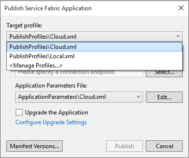

# Service Fabric Web Reference Application
The web reference application shows how to build an end-to-end Service Fabric application with multiple types of services, combining Reliable Services and Reliable Actors to construct a complete solution. 

##Scenario
The context of this sample is a web-based store with a customer order and inventory management back-end. Logical parts of the management back-end are represented by individual services, allowing loose coupling of functionality and independently-upgradeable components:

- Customer Order Service
- Inventory Service
- Restocking Service
- Web front-end Service


The customer order and inventory management system tracks user orders, removes items from the inventory to fulfill orders, and requests restocking of inventory items when an item's stock goes below a certain threshold. If a user requests items that are out of stock, the order is placed on back-order until the inventory is replenished, at which point the order is completed.

Using Service Fabric's stateful services, each of these services can maintain its own data, rather than relying a shared monolithic data base. This allows each service to scale independently using Service Fabric's stateful partitioning to meet its unique requirements for data capacity and throughput. 

## Running this sample
The majority of this application is self-contained. The only external dependency is to Azure storage for [backup & restore](https://azure.microsoft.com/en-us/documentation/articles/service-fabric-reliable-services-backup-restore/) purposes. There are no other dependencies on external services or databases to manage related to request processing or data persistence. This makes running the complete application pretty easy:

1. Open the .sln solution file in Visual Studio 2015.
2. Edit the Inventory.Service\App.config file to contain the connection details for your Azure storage account.
2. Press F5 to run.

This deploys the entire web store application on your local machine.

There are two web endpoints to begin interacting with the application:

1. **http://localhost/fabrikam/admin.html** - a very basic admin portal where you can add items into the inventory. When you first launch the application, the inventory is empty.
2. **http://localhost/fabrikam/** - a basic store front-end. This shows the current inventory and your shopping cart where you can add and purchase items to see the flow of data through the system.

## Deploy this sample to Azure
The application can be deployed to Azure by right-clicking the application project in Visual Studio and selecting "Publish". 



In the publish dialog box, select the Cloud profile and a connection endpoint. Selecting a connection endpoint from this dialog requires an Azure subscription. If you want to publish to a known cluster without an Azure subscription, you can simply edit the Cloud publish profile XML under PublishProfiles in the application project and specify a cluster connection endpoint there:

``` XML

<?xml version="1.0" encoding="utf-8"?>
<PublishProfile xmlns="http://schemas.microsoft.com/2015/05/fabrictools">
  <!-- ClusterConnectionParameters allows you to specify the PowerShell parameters to use when connecting to the Service Fabric cluster.
       Valid parameters are any that are accepted by the Connect-ServiceFabricCluster cmdlet.
       
       For a remote cluster, you would need to specify the appropriate parameters for that specific cluster.
         For example: <ClusterConnectionParameters ConnectionEndpoint="mycluster.westus.cloudapp.azure.com:19000" /> -->

  <ClusterConnectionParameters ConnectionEndpoint="mycluster.westus.cloudapp.azure.com:19000" />
  <ApplicationParameterFile Path="..\ApplicationParameters\Cloud.xml" />
</PublishProfile>

```

## Unit Tests
This application contains also unit tests to show the recommended pattern  to create tests against a Service Fabric application. 
  Below are the steps  to run or debug a test (using  Visual studio 2015 on a 64 bit windows):
  - Open the WebReferenceApp solution  in Visual studio 2015
  - Select menus "Test" / "Test Setting" / "Default processor architecture" -> x64
  - Rebuild the solution
  - Select menus "Test" / "Windows" / "Test Explorer" you should see now the text explorer window with the list of available tests
  - Choose one or more tests (for example "TestAddStock" under InventoryServiceTests)
  - Right click the test of your choice and select run the test, you will see after a while a green check mark of test passed
  - You can try also to debug the test  to  understand better  its logic 


## Next steps

- [Learn about the application architecture and data flow.](https://github.com/Azure-Samples/service-fabric-dotnet-web-reference-app/blob/master/Docs/architecture.md "Learn about the application architecture and data flow.")
